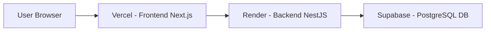

# 🚀 HeoKem English - Spaced Repetition App

Ứng dụng học & ôn tập từ vựng Tiếng Anh thông minh sử dụng **Thuật toán Lặp lại Ngắt quãng (Spaced Repetition SM-2)**, kết hợp công nghệ AI và trích xuất từ vựng từ hình ảnh (OCR).


---

## 📌 Tính năng chính (Features)

1. **📚 Ôn tập theo Bài học (Lesson-Based Review)**:
   - Gom nhóm các từ vựng đến hạn ôn tập theo từng **Bộ từ / Lesson** riêng biệt.
   - Thẻ bài học giao diện đỏ nhạt (*Urgency Theme*) tạo sự tập trung và mức độ cấp thiết.
   - Cho phép chọn ôn từng bài học cụ thể hoặc chọn "Ôn gộp tất cả".

2. **🧠 Thuật toán Spaced Repetition (SM-2)**:
   - Tự động tính toán khoảng cách ngày nhắc lại dựa trên độ chính xác khi trả lời.
   - Các từ trả lời đúng sẽ tăng khoảng cách ngày nhắc lại; các từ trả lời chưa đúng sẽ xuất hiện lại sau 1 ngày.

3. **⚡ Trắc nghiệm Siêu tốc (4 lựa chọn)**:
   - Đảo chiều ngẫu nhiên **EN ➔ VI** và **VI ➔ EN**.
   - Hỗ trợ phím tắt bàn phím `1, 2, 3, 4` cho đáp án A, B, C, D.

4. **📖 Quản lý Bộ từ vựng (Decks)**:
   - Tạo, chỉnh sửa, quản lý danh sách từ vựng cá nhân.
   - Thư viện bộ từ công khai cộng đồng (Public Decks) & hỗ trợ Clone bộ từ về tài khoản cá nhân.

5. **🤖 AI Hỗ trợ Học tập (AI Sentence Practice & Evaluation)**:
   - Tạo câu ví dụ minh họa tự động bằng AI.
   - Chấm điểm và phân tích câu Tiếng Anh do người dùng tự đặt.

6. **📷 Scan Tài liệu (OCR)**:
   - Tải ảnh tài liệu/sách báo để trích xuất tự động danh sách từ vựng.

7. **📊 Thống kê & Lịch sử**:
   - Theo dõi tổng số từ đã thuộc (*Mastered*), số bài cần ôn hôm nay và biểu đồ chuỗi ngày học.

---

## 🛠 Công nghệ sử dụng (Tech Stack)

### Backend
- **Framework**: [NestJS](https://nestjs.com/) (Node.js & TypeScript)
- **Database ORM**: [TypeORM](https://typeorm.io/) & PostgreSQL
- **Authentication**: JWT (JSON Web Token) & bcrypt
- **Validation**: `class-validator`, `class-transformer`

### Frontend
- **Framework**: [Next.js](https://nextjs.org/) (App Router, React 19)
- **Styling**: Vanilla CSS (CSS Modules / Modern Tokens, Glassmorphism, Responsive)
- **State & HTTP**: Axios, React Hooks
- **UI Components & Icons**: `lucide-react`, `canvas-confetti`

---

## 📂 Cấu trúc Thư mục Dự án

```text
SpacedRepetitionApp/
├── backend/                  # NestJS Backend API
│   ├── src/
│   │   ├── auth/            # Đăng ký / Đăng nhập / JWT Guard
│   │   ├── cards/           # Quản lý Vocabulary Cards
│   │   ├── decks/           # Quản lý Decks (Bộ từ)
│   │   ├── entities/        # TypeORM Database Entities
│   │   ├── ocr/             # Xử lý trích xuất văn bản từ ảnh
│   │   ├── questions/       # Phát sinh câu hỏi trắc nghiệm
│   │   ├── review/          # Thuật toán SM-2 & Xử lý ôn tập
│   │   ├── sessions/        # Theo dõi phiên học (Study Sessions)
│   │   └── ai/              # AI phát sinh & đánh giá câu
│   └── package.json
│
├── frontend/                 # Next.js Frontend Web App
│   ├── app/
│   │   ├── dashboard/       # Trang tổng quan
│   │   ├── decks/           # Danh sách & Chi tiết bộ từ
│   │   ├── public-decks/    # Mẫu bộ từ công khai
│   │   ├── review/          # Giao diện Ôn tập Spaced Repetition
│   │   ├── scan/            # Giao diện Scan tài liệu OCR
│   │   └── stats/           # Thống kê kết quả học
│   ├── components/          # Navigation Sidebar, Confetti,...
│   ├── lib/                 # Axios API Client & Services
│   └── package.json
│
└── docker-compose.yml        # PostgreSQL & pgAdmin local setup
```

---

## 💻 Hướng dẫn Chạy Local (Local Development)

### Yêu cầu tiên quyết
- [Node.js](https://nodejs.org/) (v18 trở lên)
- [Docker Desktop](https://www.docker.com/) (hoặc cài sẵn PostgreSQL local)

### 1. Khởi chạy Database (Docker)
```bash
# Tại thư mục gốc dự án
docker-compose up -d
```
*PostgreSQL sẽ chạy tại `localhost:5432` với Database Name `spaced_repetition`, User `spaced_user`, Password `spaced_pass`.*

### 2. Khởi chạy Backend (NestJS)
```bash
cd backend
npm install
npm run start:dev
```
*Backend API sẽ khởi chạy tại: `http://localhost:3001/api`*

### 3. Khởi chạy Frontend (Next.js)
```bash
cd ../frontend
npm install
npm run dev
```
*Frontend Web sẽ khởi chạy tại: `http://localhost:3000`*

---

## 🌍 HƯỚNG DẪN DEPLOY DỰ ÁN LÊN MẠNG (MIỄN PHÍ)

Hướng dẫn chi tiết đưa ứng dụng lên mạng cho người mới bắt đầu bằng bộ công cụ **Supabase + Render + Vercel**.



---

### 🟢 Bước 1: Deploy Database PostgreSQL lên Supabase

1. Truy cập [Supabase.com](https://supabase.com) và đăng nhập bằng GitHub.
2. Bấm **New Project**, nhập tên dự án và tạo **Database Password** (Lưu lại mật khẩu này).
3. Sau khi dự án tạo xong, vào mục **Project Settings** ➔ **Database**.
4. Lấy các thông số kết nối Connection String:
   - **Host**: `aws-0-xxxx.pooler.supabase.com` (hoặc `db.xxxx.supabase.co`)
   - **Port**: `5432` (hoặc `6543`)
   - **User**: `postgres.xxxx`
   - **Password**: *Mật khẩu bạn vừa đặt ở trên*
   - **Database Name**: `postgres`

---

### 🟡 Bước 2: Deploy Backend (NestJS) lên Render.com

1. Đẩy toàn bộ mã nguồn của bạn lên GitHub Repository.
2. Truy cập [Render.com](https://render.com) và đăng nhập.
3. Bấm **New +** ➔ chọn **Web Service**.
4. Kết nối với GitHub Repository `SpacedRepetitionApp`.
5. Cấu hình thông tin Web Service:
   - **Name**: `spaced-repetition-api`
   - **Root Directory**: `backend`
   - **Environment**: `Node`
   - **Build Command**: `npm install && npm run build`
   - **Start Command**: `npm run start:prod`
6. Thêm các **Environment Variables (Biến môi trường)** trong Render:
   - `DB_HOST`: *(Host từ Supabase)*
   - `DB_PORT`: `5432`
   - `DB_USERNAME`: *(User từ Supabase)*
   - `DB_PASSWORD`: *(Password từ Supabase)*
   - `DB_DATABASE`: `postgres`
   - `JWT_SECRET`: *(Một chuỗi bí mật ngẫu nhiên bất kỳ, ví dụ: `my_super_secret_jwt_key_2026`)*
   - `FRONTEND_URL`: *(Sẽ cập nhật URL Vercel ở Bước 3)*
7. Bấm **Create Web Service**. Đợi Render build xong, bạn sẽ nhận được URL Backend dạng:  
   👉 `https://spaced-repetition-api.onrender.com`

---

### 🔵 Bước 3: Deploy Frontend (Next.js) lên Vercel

1. Truy cập [Vercel.com](https://vercel.com) và đăng nhập bằng GitHub.
2. Bấm **Add New...** ➔ **Project**.
3. Chọn Repository `SpacedRepetitionApp`.
4. Cấu hình Project:
   - **Framework Preset**: `Next.js`
   - **Root Directory**: Chọn `Edit` và trỏ vào folder `frontend`.
5. Trong mục **Environment Variables**, thêm biến:
   - `NEXT_PUBLIC_API_URL`: `https://spaced-repetition-api.onrender.com/api` *(Dán URL Render thu được từ Bước 2 vào đây, có đuôi `/api`)*
6. Bấm **Deploy**.
7. Sau 1 - 2 phút Vercel build xong, bạn sẽ có domain chính thức dạng:  
   👉 `https://spaced-repetition-app.vercel.app`

---

### 🔄 Bước 4: Khớp nối CORS

1. Quay lại trang quản lý **Render** ➔ **Environment**.
2. Cập nhật biến `FRONTEND_URL` thành domain Vercel của bạn:  
   `FRONTEND_URL` = `https://spaced-repetition-app.vercel.app`
3. Nhấn **Save Changes** để Render tự động restart service.

🎉 **Chúc mừng! Ứng dụng của bạn đã hoạt động 100% trên môi trường Internet.**

---

## 📝 License

Dự án phát hành theo giấy phép [MIT License](LICENSE).
